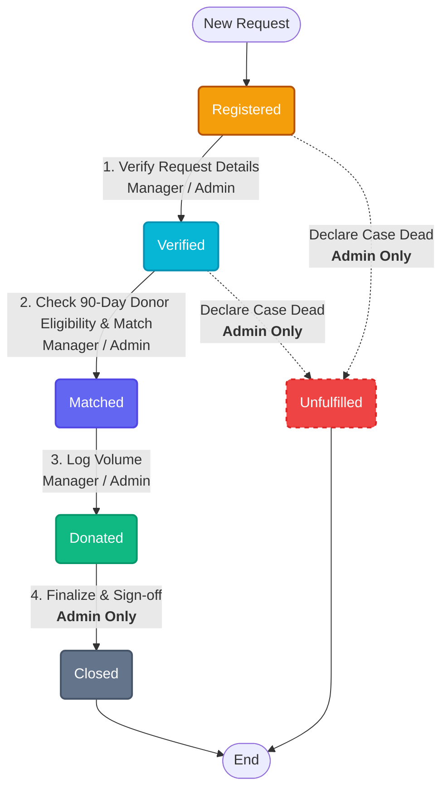

# CAP-23 Workflow & RBAC State Diagram

This document illustrates the complete lifecycle of a **Donation Request** as defined in `CAP-23_FDD.md`, detailing the 6 primary states (including the Deviation D-001 `Unfulfilled` terminal state), the required transitions, and the specific actors authorized to execute them.

## Master Workflow Diagram

## Role-Based Access Control (RBAC) Enforcement Summary

* **Manager (Camp Coordinator):**
  * Allowed to move a request through `Registered` → `Verified` → `Matched` → `Donated`.
  * Structurally blocked from modifying requests that do not match their assigned `campId`.
  * Cannot finalize a request directly. They can only transition `Donated` requests into a queue for Admin closure, or flag early-stage requests as `Unfulfillable`.
* **Admin:**
  * Has global, system-wide authority across all camps.
  * Holds **exclusive database write access** to transition any request into the terminal `Closed` or `Unfulfilled` states, enforcing a rigorous separation-of-duty.
* **User (Donor):**
  * Read-only visibility into their assigned matched requests via their Dashboard. No authority to alter workflow states.
